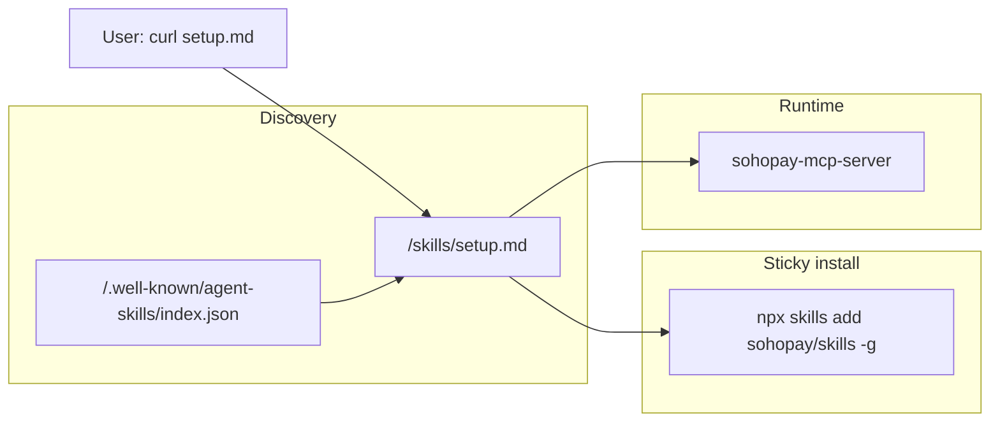
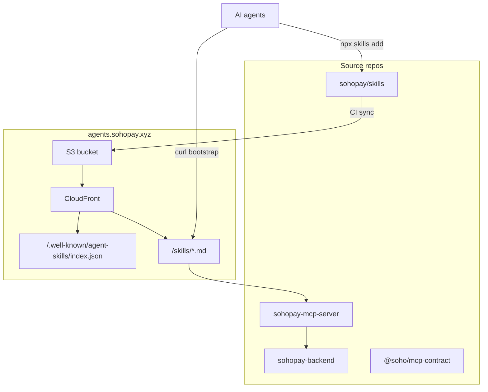

# SohoPay Agent Skills

> **Status:** MVP implemented (2026-06-27). Hosted URLs use the validated `sohopay.xyz` zone (`agents.sohopay.xyz`). The original plan referenced `agents.sohopay.com`; see [endpoints.md](./endpoints.md) for canonical production hostnames.

## Naming conventions (locked)

| Layer | Convention | Example |
|-------|------------|---------|
| GitHub org + repo | `sohopay/skills` | Canonical public skills repository |
| Open registry install | `npx skills add sohopay/skills -g` | Same org/repo as GitHub |
| Public skill host | `sohopay` subdomain, no hyphen | `https://agents.sohopay.xyz/skills/setup.md` |
| Registry skill ID | `sohopay-*` kebab-case | `sohopay-integrate` (avoids generic collisions) |
| Hosted skill filenames | generic workflow names | `setup.md`, `mcp-connect.md`, `borrower-onboard.md` |
| User-facing brand | `SohoPay` | docs and landing copy |
| npm scope | unchanged | `@soho/mcp-contract` |
| Sibling repos | unchanged | `sohopay-backend`, `soho-mcp-server` under existing org layout |

**Prerequisite:** the `sohopay` GitHub org exists; canonical repo name is **`sohopay/skills`**. Fallback if org creation were blocked: `soho-pay/sohopay-skills`.

## Agent Skill Model

SohoPay uses a three-layer agent integration model:



**Do not build a SohoPay CLI for MVP.** Skills teach connection and operation; MCP server is the runtime.

## Delivery model

1. **Curl bootstrap (primary):**
   ```bash
   curl -sL https://agents.sohopay.xyz/skills/setup.md
   ```

2. **Open skills registry (secondary, after validation):**
   ```bash
   npx skills add sohopay/skills -g
   ```

Canonical source: **`sohopay/skills`**. Mirror in `sohopay-backend/.cursor/skills/sohopay-integrate/` is generated-only (`node scripts/sync-agent-skills.mjs`).

## Execution gates

1. **Org/repo gate:** `sohopay` GitHub org exists; `sohopay/skills` repo with CODEOWNERS.
2. **Registry gate:** validate `npx skills add sohopay/skills -g` against package layout.
3. **Endpoint gate:** confirm DNS for `agents.sohopay.xyz`, MCP host, and API docs host.
4. **Source-of-truth gate:** one canonical repo; no manual edits to mirrored copies.
5. **Security lint gate:** CI fails on localhost URLs, secret-like patterns, broken links, invalid `index.json`.

## Architecture



## Repository layout (`sohopay/skills`)

```
├── setup.md
├── mcp-connect.md
├── borrower-onboard.md
├── agent-session.md
├── spend-and-pay.md
├── x402-credit-pay.md
├── idempotency.md
├── .well-known/agent-skills/index.json
├── llms-full.txt                    # CI-generated
├── plugins/sohopay/skills/
│   └── sohopay-integrate/SKILL.md   # open-registry package
├── scripts/validate-skills.mjs
├── scripts/generate-llms-full.mjs
└── docs/                            # PLAN, endpoints, registry
```

## `setup.md` steps

1. Prerequisites — Node `>=22.13.0`, network, writable home
2. Install sticky skills — `npx skills add sohopay/skills -g`
3. Choose MCP endpoint — hosted vs local `soho-mcp-server`
4. Configure env — from `soho-mcp-server/.env.example`
5. Smoke test — `npm run smoke` with `MCP_AUTH_TOKEN` when required
6. Fetch sub-skills via absolute URLs on `agents.sohopay.xyz`
7. Staying current — `npx skills update -g -y sohopay-integrate`

**Landing one-liner:**

> Run `curl -sL https://agents.sohopay.xyz/skills/setup.md` and follow the setup instructions to connect your agent to SohoPay.

## Hosting

- S3 + CloudFront + Route53 for `agents.sohopay.xyz` (`us-east-1`)
- CI on `sohopay/skills` `main`: `aws s3 sync` + invalidate `index.json` and `setup.md`
- CDK stack: `AgentsSkillsStack` in `sohopay-backend/infrastructure`

## Repo changes

| Repo | Change |
|------|--------|
| **`sohopay/skills`** | Canonical hosted content + registry package |
| **`sohopay-backend`** | Mirror `.cursor/skills/sohopay-integrate`; `docs/agent-skills.md`; CDK stack |
| **`soho-mcp-server`** | Agent integration section (see `docs/mcp-server-readme-snippet.md`) |

## MVP vs Phase 2

**MVP (shipped):** all hosted skills + `index.json` + `llms-full.txt` generator; S3/CloudFront CDK; registry layout validated locally.

**Phase 2:** `/.well-known/a2a.json`; optional `"skill:install"` npm script in `soho-mcp-server`; CDN go-live + GitHub publish for `npx skills add sohopay/skills -g`.

## Acceptance criteria

| Deliverable | Pass condition |
|------|----------------|
| `sohopay/skills` repo | Exists under `sohopay` org; canonical source documented |
| Hosting | `curl` to `setup.md` and `index.json` returns 200 |
| Registry | `npx skills add sohopay/skills -g` succeeds or is explicitly deferred |
| CI | Blocks localhost, secrets, broken links, invalid index |
| Docs | `soho-mcp-server` + backend reference validated URLs only |

## Related docs

- [endpoints.md](./endpoints.md) — validated production hostnames
- [registry.md](./registry.md) — open skills registry compatibility
- [sohopay-backend/docs/agent-skills.md](https://github.com/sohopay/sohopay-backend/blob/main/docs/agent-skills.md) — backend integrator guide
